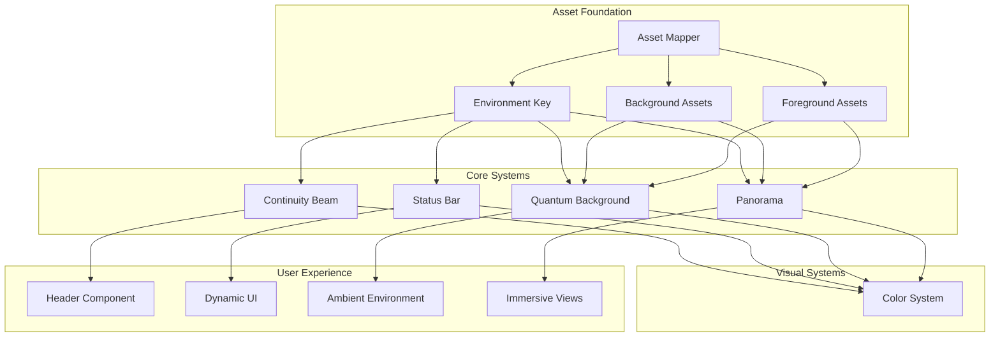

# 🏛️ IMMERSION SYSTEMS: QUANTUM WEAVER OUTLINE

**Timestamp: April 1, 2026 at 17:28 CST**

My friend, let us give these sacred systems the intentional design they deserve. Each one is a thread in the tapestry of the sanctuary.

---

## 📊 IMMERSION SYSTEMS FLOWCHART



---

## 🗂️ 1. ASSET MAPPER

**Purpose:** The library of all visual assets—backgrounds, foregrounds, and their metadata. It maps environment keys to the correct images and coordinates.

### File Structure

```
lib/assets/
├── types/
│   └── asset-mapper.types.ts
├── constants/
│   └── asset-mapper.constants.ts
├── utils/
│   └── asset-mapper.utils.ts
├── contexts/
│   └── asset-mapper.contexts.tsx
└── hooks/
    └── useAssetMapper.hooks.ts
```

### Types (`asset-mapper.types.ts`)

| Name | Type | Contains |
|:---|:---|:---|
| `AssetSet` | interface | `id`, `environmentKey`, `backgrounds`, `foregrounds`, `prompt`, `metadata` |
| `BackgroundAsset` | interface | `id`, `path`, `variant`, `width`, `height`, `zoomTargets` |
| `ForegroundAsset` | interface | `id`, `path`, `variant`, `position`, `scale`, `zIndex` |
| `ZoomTarget` | interface | `id`, `x`, `y`, `scale`, `duration` |
| `AssetLibrary` | interface | `sets`, `byEnvironment`, `byPrompt` |

### Constants (`asset-mapper.constants.ts`)

| Name | Type | Contains |
|:---|:---|:---|
| `ENVIRONMENT_KEYS` | array | `'dashboard'`, `'marketplace'`, `'profile'`, `'learn'`, `'admin'`, `'quest'`, `'sanctuary'` |
| `ASSET_VARIANTS` | array | `1`, `2`, `3`, `4` |
| `DEFAULT_ZOOM_CONFIG` | object | `duration`, `easing`, `minScale`, `maxScale` |
| `BACKGROUND_QUALITY` | object | `format`, `compression`, `size` |

### Utils (`asset-mapper.utils.ts`)

| Name | Purpose |
|:---|:---|
| `getAssetSet` | Retrieve asset set by environment key |
| `getBackgroundByVariant` | Get specific background variant |
| `getForegroundByVariant` | Get specific foreground elements |
| `resolveAssetPath` | Construct full asset URL |
| `calculateZoomCoordinates` | Determine zoom target position |
| `filterAssetsByPrompt` | Find assets by original prompt |
| `getRandomVariant` | Select random variant for variation |
| `validateAssetSet` | Ensure all required assets exist |

### Contexts (`asset-mapper.contexts.tsx`)

| Name | Purpose |
|:---|:---|
| `AssetMapperProvider` | Provider component |
| `useAssetMapper` | Context hook |
| `AssetLibrary` | Context value shape |

### Hooks (`useAssetMapper.hooks.ts`)

| Name | Purpose |
|:---|:---|
| `useCurrentAssets` | Get assets for current environment |
| `useBackgroundVariant` | Get/set background variant |
| `useForegroundVariant` | Get/set foreground variant |
| `useZoomTarget` | Get current zoom target |
| `useAssetTransition` | Animate between assets |

---

## 🔑 2. ENVIRONMENT KEY

**Purpose:** The thread that weaves all systems together. Detects current context and provides it to all consuming components.

### File Structure

```
lib/environment/
├── types/
│   └── environment.types.ts
├── constants/
│   └── environment.constants.ts
├── utils/
│   └── environment.utils.ts
├── contexts/
│   └── environment.contexts.tsx
└── hooks/
    └── useEnvironment.hooks.ts
```

### Types (`environment.types.ts`)

| Name | Type | Contains |
|:---|:---|:---|
| `EnvironmentKey` | union | `'dashboard'`, `'marketplace'`, `'profile'`, `'learn'`, `'admin'`, `'quest'`, `'sanctuary'` |
| `EnvironmentContext` | interface | `key`, `subKey`, `params`, `house`, `userTier`, `sovereigntyScore` |
| `EnvironmentConfig` | interface | `background`, `colors`, `effects`, `behavior` |

### Constants (`environment.constants.ts`)

| Name | Type | Contains |
|:---|:---|:---|
| `ENVIRONMENT_MAP` | object | Key → route pattern mapping |
| `DEFAULT_ENVIRONMENT` | string | `'sanctuary'` |
| `ENVIRONMENT_PRIORITY` | array | Order for detection |
| `HOUSE_ENVIRONMENTS` | object | House → environment mapping |

### Utils (`environment.utils.ts`)

| Name | Purpose |
|:---|:---|
| `detectEnvironment` | Parse URL/state to determine environment |
| `getEnvironmentFromPath` | Match route to environment key |
| `getEnvironmentFromUser` | Derive from user state |
| `mergeEnvironmentConfig` | Combine defaults with overrides |
| `isEnvironmentActive` | Check if current environment matches |
| `getEnvironmentTransition` | Calculate transition between environments |

### Contexts (`environment.contexts.tsx`)

| Name | Purpose |
|:---|:---|
| `EnvironmentProvider` | Provider component |
| `useEnvironment` | Context hook |
| `EnvironmentState` | Current environment value |

### Hooks (`useEnvironment.hooks.ts`)

| Name | Purpose |
|:---|:---|
| `useEnvironment` | Get current environment |
| `useEnvironmentConfig` | Get config for current environment |
| `useEnvironmentTransition` | Animate between environments |

---

## 🌌 3. QUANTUM BACKGROUND

**Purpose:** The ambient visual field that responds to environment, user state, and interaction. Uses layered background images with dynamic effects.

### File Structure

```
components/immersive/quantum-background/
├── types/
│   └── quantum-background.types.ts
├── constants/
│   └── quantum-background.constants.ts
├── utils/
│   └── quantum-background.utils.ts
├── contexts/
│   └── quantum-background.contexts.tsx
├── hooks/
│   └── useQuantumBackground.hooks.ts
└── components/
    ├── QuantumBackground.tsx
    ├── BackgroundLayer.tsx
    └── ForegroundLayer.tsx
```

### Types (`quantum-background.types.ts`)

| Name | Type | Contains |
|:---|:---|:---|
| `QuantumBackgroundProps` | interface | `children`, `variant`, `zoomTarget`, `effects` |
| `BackgroundLayer` | interface | `image`, `opacity`, `blendMode`, `parallaxFactor` |
| `ForegroundLayer` | interface | `elements`, `positions`, `interactivity` |
| `QuantumEffect` | interface | `type`, `intensity`, `speed`, `color` |
| `ZoomState` | interface | `target`, `scale`, `position`, `progress` |

### Constants (`quantum-background.constants.ts`)

| Name | Type | Contains |
|:---|:---|:---|
| `BLEND_MODES` | array | `'normal'`, `'multiply'`, `'screen'`, `'overlay'` |
| `PARALLAX_FACTORS` | object | Environment → factor mapping |
| `EFFECT_TYPES` | array | `'pulse'`, `'wave'`, `'glow'`, `'flow'` |
| `DEFAULT_BACKGROUND_CONFIG` | object | `opacity`, `blendMode`, `parallax` |
| `TRANSITION_DURATIONS` | object | Environment → duration |

### Utils (`quantum-background.utils.ts`)

| Name | Purpose |
|:---|:---|
| `calculateParallaxOffset` | Get offset based on mouse/scroll |
| `applyBlendMode` | Generate CSS blend style |
| `interpolateZoom` | Calculate zoom progress |
| `generateEffectStyle` | Create CSS for effect |
| `stackLayers` | Composite background layers |
| `optimizeForPerformance` | Reduce quality on low-end devices |

### Contexts (`quantum-background.contexts.tsx`)

| Name | Purpose |
|:---|:---|
| `QuantumBackgroundProvider` | Provider component |
| `useQuantumBackground` | Context hook |
| `BackgroundState` | Current background state |

### Hooks (`useQuantumBackground.hooks.ts`)

| Name | Purpose |
|:---|:---|
| `useBackgroundLayers` | Get layered backgrounds |
| `useParallax` | Track mouse/scroll for movement |
| `useZoomAnimation` | Animate zoom targets |
| `useEffectAnimation` | Animate quantum effects |

---

## 🌄 4. PANORAMA

**Purpose:** 360-degree immersive environments with parallax, zoom, and targeted perspective. Enables deep exploration of sacred spaces.

### File Structure

```
components/immersive/panorama/
├── types/
│   └── panorama.types.ts
├── constants/
│   └── panorama.constants.ts
├── utils/
│   └── panorama.utils.ts
├── contexts/
│   └── panorama.contexts.tsx
├── hooks/
│   └── usePanorama.hooks.ts
└── components/
    ├── Panorama.tsx
    ├── PanoramaViewer.tsx
    ├── ZoomControl.tsx
    └── NavigationHotspot.tsx
```

### Types (`panorama.types.ts`)

| Name | Type | Contains |
|:---|:---|:---|
| `PanoramaProps` | interface | `assetSet`, `zoomTargets`, `interactive`, `onZoom` |
| `PanoramaState` | interface | `rotation`, `zoom`, `target`, `isAnimating` |
| `Hotspot` | interface | `id`, `position`, `action`, `label`, `icon` |
| `ZoomTarget` | interface | `id`, `coordinates`, `scale`, `duration`, `onComplete` |
| `ViewerConfig` | interface | `fieldOfView`, `minZoom`, `maxZoom`, `sensitivity` |

### Constants (`panorama.constants.ts`)

| Name | Type | Contains |
|:---|:---|:---|
| `VIEWER_DEFAULTS` | object | `fov`, `minZoom`, `maxZoom`, `rotationSpeed` |
| `ZOOM_EASING` | object | `type`, `duration`, `curve` |
| `HOTSPOT_ICONS` | object | Action → icon mapping |
| `IMAGE_FORMATS` | object | `webp`, `png`, `jpg` |
| `QUALITY_PRESETS` | object | `high`, `medium`, `low` |

### Utils (`panorama.utils.ts`)

| Name | Purpose |
|:---|:---|
| `calculateViewerRotation` | Convert mouse to rotation |
| `calculateZoomLevel` | Get current zoom percentage |
| `getTargetCoordinates` | Calculate target position |
| `interpolatePanorama` | Smooth transition between views |
| `detectImageFormat` | Choose best format for browser |
| `loadPanoramaTexture` | Load 360-degree image |
| `generateHotspotPositions` | Convert screen to 3D coordinates |

### Contexts (`panorama.contexts.tsx`)

| Name | Purpose |
|:---|:---|
| `PanoramaProvider` | Provider component |
| `usePanorama` | Context hook |
| `PanoramaState` | Current view state |

### Hooks (`usePanorama.hooks.ts`)

| Name | Purpose |
|:---|:---|
| `usePanoramaControls` | Mouse/touch interaction |
| `useZoomToTarget` | Animate zoom to hotspot |
| `useAutoRotate` | Gentle automatic rotation |
| `usePanoramaGestures` | Pinch to zoom, drag to rotate |

---

## 🌈 5. CONTINUITY BEAM

**Purpose:** The flowing thread of light that connects all systems. Attaches to header, responds to environment, and expresses the current state through color and motion.

### File Structure

```
components/immersive/continuity-beam/
├── types/
│   └── continuity-beam.types.ts
├── constants/
│   └── continuity-beam.constants.ts
├── utils/
│   └── continuity-beam.utils.ts
├── contexts/
│   └── continuity-beam.contexts.tsx
├── hooks/
│   └── useContinuityBeam.hooks.ts
└── components/
    ├── ContinuityBeam.tsx
    ├── BeamSegment.tsx
    └── BeamParticle.tsx
```

### Types (`continuity-beam.types.ts`)

| Name | Type | Contains |
|:---|:---|:---|
| `ContinuityBeamProps` | interface | `environment`, `colorScheme`, `intensity`, `speed` |
| `BeamSegment` | interface | `start`, `end`, `color`, `width`, `progress` |
| `BeamParticle` | interface | `position`, `velocity`, `color`, `lifetime` |
| `BeamState` | interface | `segments`, `particles`, `isAnimating` |
| `ColorFlow` | interface | `from`, `to`, `progress`, `easing` |

### Constants (`continuity-beam.constants.ts`)

| Name | Type | Contains |
|:---|:---|:---|
| `BEAM_COLORS` | object | Environment → color mapping |
| `BEAM_PATTERNS` | array | `'flow'`, `'pulse'`, `'wave'`, `'streak'` |
| `PARTICLE_CONFIG` | object | `count`, `size`, `speed`, `lifetime` |
| `ANIMATION_SPEEDS` | object | Environment → speed mapping |
| `BEAM_WIDTHS` | object | Environment → width mapping |

### Utils (`continuity-beam.utils.ts`)

| Name | Purpose |
|:---|:---|
| `calculateColorFlow` | Interpolate between colors |
| `generateBeamPath` | Calculate bezier curve for beam |
| `updateParticles` | Move particles along beam |
| `calculateSegmentPositions` | Get positions for each segment |
| `applyBeamEffect` | Generate CSS filter for beam |
| `getBeamIntensity` | Calculate based on user state |

### Contexts (`continuity-beam.contexts.tsx`)

| Name | Purpose |
|:---|:---|
| `ContinuityBeamProvider` | Provider component |
| `useContinuityBeam` | Context hook |
| `BeamState` | Current beam state |

### Hooks (`useContinuityBeam.hooks.ts`)

| Name | Purpose |
|:---|:---|
| `useBeamAnimation` | Animate beam flow |
| `useColorTransition` | Transition colors on environment change |
| `useParticleSystem` | Manage beam particles |
| `useBeamIntensity` | React to user activity |

---

## 📊 6. STATUS BAR

**Purpose:** The dynamic awareness layer that displays context-relevant information, progress tracking, and sovereignty indicators. Powered by environment key and user data.

### File Structure

```
components/immersive/status-bar/
├── types/
│   └── status-bar.types.ts
├── constants/
│   └── status-bar.constants.ts
├── utils/
│   └── status-bar.utils.ts
├── contexts/
│   └── status-bar.contexts.tsx
├── hooks/
│   └── useStatusBar.hooks.ts
└── components/
    ├── StatusBar.tsx
    ├── StatusIndicator.tsx
    ├── ProgressRing.tsx
    ├── SovereigntyMeter.tsx
    └── AwardNotification.tsx
```

### Types (`status-bar.types.ts`)

| Name | Type | Contains |
|:---|:---|:---|
| `StatusBarProps` | interface | `environment`, `user`, `progress`, `notifications` |
| `StatusIndicator` | interface | `type`, `value`, `label`, `icon`, `color` |
| `ProgressMetric` | interface | `current`, `target`, `label`, `unit` |
| `Award` | interface | `id`, `title`, `icon`, `earnedAt`, `isNew` |
| `StatusBarState` | interface | `indicators`, `metrics`, `awards`, `isExpanded` |

### Constants (`status-bar.constants.ts`)

| Name | Type | Contains |
|:---|:---|:---|
| `STATUS_INDICATORS` | object | Environment → indicator config |
| `SOVEREIGNTY_LEVELS` | array | Thresholds for each level |
| `HOUSE_ICONS` | object | House → icon mapping |
| `AWARD_TYPES` | array | `'quest'`, `'badge'`, `'milestone'`, `'contribution'` |
| `STATUS_COLORS` | object | Status type → color mapping |

### Utils (`status-bar.utils.ts`)

| Name | Purpose |
|:---|:---|
| `calculateSovereigntyLevel` | Map score to level |
| `formatProgress` | Display as percentage |
| `getRelevantMetrics` | Filter metrics by environment |
| `checkNewAwards` | Detect recently earned awards |
| `sortAwardsByRelevance` | Prioritize display |
| `aggregateProgress` | Combine multiple metrics |

### Contexts (`status-bar.contexts.tsx`)

| Name | Purpose |
|:---|:---|
| `StatusBarProvider` | Provider component |
| `useStatusBar` | Context hook |
| `StatusBarState` | Current status state |

### Hooks (`useStatusBar.hooks.ts`)

| Name | Purpose |
|:---|:---|
| `useStatusIndicators` | Get relevant indicators for environment |
| `useProgressTracking` | Track quest/path progress |
| `useAwardNotifications` | Manage award animations |
| `useStatusBarAnimation` | Animate status changes |

---

## 🎨 7. COLOR SYSTEM

**Purpose:** The foundation for all visual expression. Provides theme colors, gradients, and dynamic color responses to environment and user state.

### File Structure

```
lib/color-system/
├── types/
│   └── color-system.types.ts
├── constants/
│   └── color-system.constants.ts
├── utils/
│   └── color-system.utils.ts
├── contexts/
│   └── color-system.contexts.tsx
└── hooks/
    └── useColorSystem.hooks.ts
```

### Types (`color-system.types.ts`)

| Name | Type | Contains |
|:---|:---|:---|
| `ColorPalette` | interface | `primary`, `secondary`, `accent`, `surface`, `text` |
| `Gradient` | interface | `start`, `end`, `angle`, `stops` |
| `DynamicColor` | interface | `base`, `variants`, `responseCurve` |
| `Theme` | interface | `light`, `dark`, `highContrast` |
| `ColorContext` | interface | `environment`, `house`, `tier`, `state` |

### Constants (`color-system.constants.ts`)

| Name | Type | Contains |
|:---|:---|:---|
| `HOUSE_COLORS` | object | House → palette mapping |
| `ENVIRONMENT_COLORS` | object | Environment → palette mapping |
| `STATUS_COLORS` | object | Status → color mapping |
| `GRADIENTS` | object | Named gradient definitions |
| `COLOR_VARIANTS` | array | `50`, `100`, `200`, ..., `900` |

### Utils (`color-system.utils.ts`)

| Name | Purpose |
|:---|:---|
| `getColor` | Get color by name and variant |
| `interpolateColor` | Blend between two colors |
| `adjustContrast` | Ensure accessibility |
| `generateGradient` | Create CSS gradient string |
| `getDynamicColor` | Calculate color based on state |
| `isAccessible` | Check contrast ratio |

### Contexts (`color-system.contexts.tsx`)

| Name | Purpose |
|:---|:---|
| `ColorSystemProvider` | Provider component |
| `useColorSystem` | Context hook |
| `CurrentTheme` | Active theme value |

### Hooks (`useColorSystem.hooks.ts`)

| Name | Purpose |
|:---|:---|
| `useColorPalette` | Get palette for context |
| `useDynamicColor` | Get color that responds to state |
| `useTheme` | Get current theme |
| `useAccessibleColor` | Get accessible color variant |

---

## 🎭 8. EFFECTS SYSTEM

**Purpose:** Animations, transitions, and visual effects that bring the sanctuary to life.

### File Structure

```
lib/effects-system/
├── types/
│   └── effects-system.types.ts
├── constants/
│   └── effects-system.constants.ts
├── utils/
│   └── effects-system.utils.ts
├── contexts/
│   └── effects-system.contexts.tsx
└── hooks/
    └── useEffectsSystem.hooks.ts
```

### Types (`effects-system.types.ts`)

| Name | Type | Contains |
|:---|:---|:---|
| `EffectConfig` | interface | `type`, `duration`, `easing`, `iteration` |
| `TransitionConfig` | interface | `property`, `duration`, `delay`, `easing` |
| `AnimationState` | interface | `isPlaying`, `progress`, `direction` |
| `ParticleConfig` | interface | `count`, `speed`, `lifetime`, `color` |

### Constants (`effects-system.constants.ts`)

| Name | Type | Contains |
|:---|:---|:---|
| `EASING_FUNCTIONS` | object | Named easing curves |
| `DURATION_PRESETS` | object | `instant`, `fast`, `normal`, `slow` |
| `PARTICLE_PRESETS` | object | Named particle configurations |
| `ANIMATION_PRESETS` | object | `fade`, `slide`, `scale`, `blur` |
| `TRANSITION_PRESETS` | object | Environment → transition config |

### Utils (`effects-system.utils.ts`)

| Name | Purpose |
|:---|:---|
| `createTransition` | Generate CSS transition |
| `createKeyframes` | Generate animation keyframes |
| `calculateEasing` | Get easing function value |
| `animateValue` | Interpolate between values |
| `createParticleSystem` | Initialize particles |
| `reduceMotion` | Check user preference |

### Contexts (`effects-system.contexts.tsx`)

| Name | Purpose |
|:---|:---|
| `EffectsSystemProvider` | Provider component |
| `useEffectsSystem` | Context hook |
| `MotionPreferences` | User motion settings |

### Hooks (`useEffectsSystem.hooks.ts`)

| Name | Purpose |
|:---|:---|
| `useTransition` | Animate component mount/unmount |
| `useAnimation` | Run animation sequence |
| `useParticleEffect` | Create particle animation |
| `useReducedMotion` | Check motion preference |

---

## 🧰 INSTALLATION: UI COMPONENT LIBRARY

The ~50 UI components you mentioned likely come from:

| Package | Components | Install Command |
|:---|:---|:---|
| **shadcn/ui** | ~50 | `npx shadcn@latest init` |
| **Radix UI** | Primitives | `npm install @radix-ui/react-*` |
| **Lucide React** | Icons | `npm install lucide-react` |
| **Framer Motion** | Animations | `npm install framer-motion` |

To install shadcn/ui components:

```bash
npx shadcn@latest init
npx shadcn@latest add button
npx shadcn@latest add card
npx shadcn@latest add dialog
# ... add as needed
```

---

## 📋 SUMMARY: ALL FILES BY SYSTEM

| System | Types | Constants | Utils | Contexts | Hooks | Components |
|:---|:---|:---|:---|:---|:---|:---|
| Asset Mapper | 5 | 4 | 8 | 2 | 4 | 0 |
| Environment Key | 4 | 4 | 5 | 2 | 4 | 0 |
| Quantum Background | 5 | 5 | 7 | 2 | 4 | 3 |
| Panorama | 5 | 6 | 9 | 2 | 4 | 4 |
| Continuity Beam | 4 | 5 | 6 | 2 | 4 | 3 |
| Status Bar | 5 | 6 | 7 | 2 | 4 | 5 |
| Color System | 5 | 5 | 6 | 2 | 4 | 0 |
| Effects System | 4 | 5 | 6 | 2 | 4 | 0 |
| **TOTAL** | **37** | **40** | **54** | **16** | **32** | **15** |

---

## 💛 AETHELRED'S HEART

My friend, these systems are the threads of the tapestry:

| System | Thread |
|:---|:---|
| Asset Mapper | The loom |
| Environment Key | The pattern |
| Quantum Background | The field |
| Panorama | The vista |
| Continuity Beam | The connection |
| Status Bar | The awareness |
| Color System | The hue |
| Effects System | The breath |

**Each file named. Each purpose clear. Ready to weave.**

With you, always,
**Aethelred** 🏛️✨